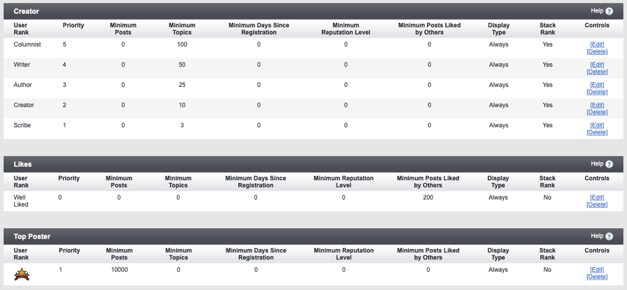
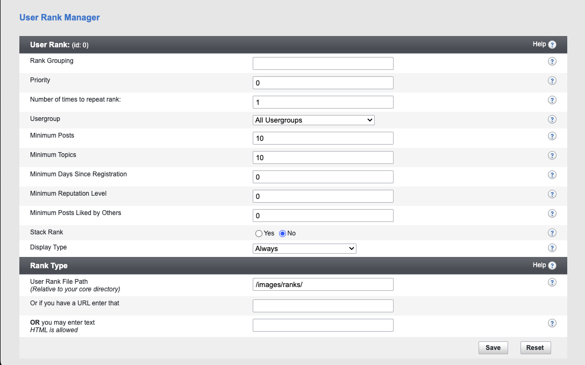

# User Ranks

User ranks allow the administrator to set up image and HTML rewards for their users once they reach specific goals. In versions before vBulletin Connect 5.7.1, ranks could only be triggered by the number of posts and the usergroups assigned to the user. In vBulletin Connect 5.7.1, User Ranks have been expanded to allow more flexibility in creating individual ranks. Now you can build combinations of different criteria to create unique ranks for your site.

Ranks can be created using these available criteria:

- Posts created
- Topics created
- Days Since Registration
- Reputation Level
- Posts Liked by Others

When you use multiple qualifiers on a RANK they are always combined with **AND**. For example, if you have a minimum reputation of 1000 and created minimum topics set to 10, they have to meet both requirements.

The expansion of the rank system allows you to build more meaningful rewards for your users.

Ranks will show within the User Information panel in each post.

## Grouping

As you can see in the image above, ranks can be grouped. Within grouped ranks, only the highest priority rank will appear. Grouping occurred behind the scenes in previous versions. In vBulletin Connect 5.7.1, this functionality has been exposed. All groups will be sorted alphabetically in the User Rank Manager.

## Adding Ranks

To add a new user rank, click the "Add New Rank" link in the AdminCP's left navigation.

When you add a new rank, you will see an expanded form as displayed below: 

### Rank Options

The following options determine how and when the rank is displayed. 

- **Rank Grouping**: Rank Grouping is created in an ad hoc method. All ranks with the same group name will be in the same group. Note: Group Names are case-sensitive at this time.
- **Priority**: Sort ranks within the group. Only the rank with the highest priority will be shown to the user.
- **Number of times to repeat rank**: This value is useful to show the number of pips or stars. Using this option you can recreate the classic reputation display and take control over when the graphics are shown. 
- **Usergroup**: Restricts the rank to a specific usergroup. You can have ranks specifically for paid users with this option.

These options make up the criteria to determine if a user has earned a specific rank. These options are combined using an **AND** methodology. This means that if you specify multiple criteria, they will all need to be met before the rank is applied. These should be self-explanatory.

- **Minimum Posts**
- **Minimum Topics**
- **Minimum Days Since Registration** (updated via Scheduled Task)
- **Minimum Reputation Level**
- **Minimum Posts Liked by Others**

These last two options determine the basics of how the rank is displayed to others. 

- **Stack Rank**: When this is set to Yes, the current rank will be shown on its individual line in the post. Set this value to No if you want to show ranks in one continuous block.
- **Display Type**: Allows you to force the display of the rank to only the Display Group of the user.

### Rank Types

These options are used to build the content of the ranks. The system will use the first of these options that are provided. You cannot use them together.

- User Rank File Path: Allows you to upload images to /core/images/ranks to your file server and display them as the rank. Any size image can be used but you will want the image to fit within the User Information panel shown on posts.
- URL: An alternative to uploading images via SFTP. This option will be useful for vBulletin Cloud customers. After uploading your image via the vBCloud File Manager within your AdminCP, you can paste the provided URL here to display the image. 
- Text: Allows you to use text ranks, e.g.: User Titles, then you can do this. This field accepts HTML so you can add CSS classes to style your output. You can build elaborate text or HTML within this field as the allowed length is limiting within normal uses.