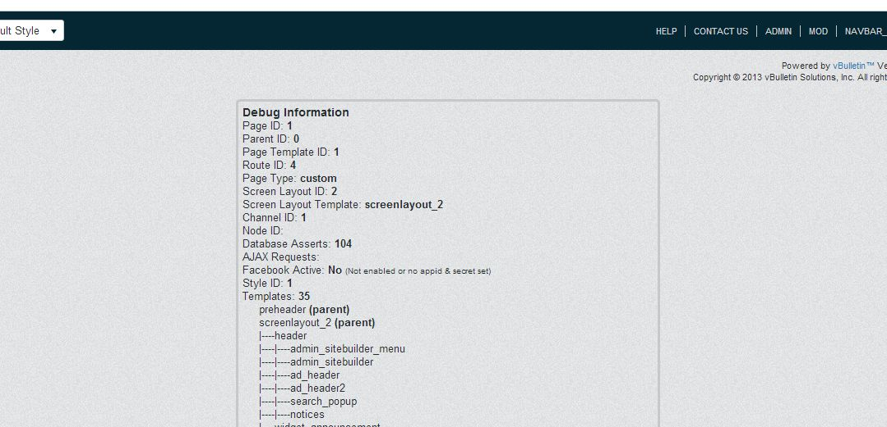

[toc]
Debug mode is useful for development purposes- it is required if you will be creating VB5 Modifications you intend to distribute for others to download. However it is also useful for trouble-shooting issues with your site as debug mode often provides more specific error messages when something goes wrong- as such if you are having trouble support will often ask you to put your site into debug mode.

Debug mode requires two small file edits in vBulletin 5. This is because VB5 has two config.php files by design. Both files require an edit and it is a little different for each.

## Presentation config.php
Edit your front-end or "Presentation" config,php file. This is the one in your forum-root directory.

Download this file from your server and open it in your text editor. Look for the line that says:
```php
$config['debug'] = false;  
```

Change this line so it reads as:
```php
$config['debug'] = true;
```
Then save the file and re-upload it to your server overwriting the existing file.

Test your site- make sure it loads- it should- if you run into any problem simply re-copy the original config.php file from the original VB Install package and overwrite it, but it is very unlikely you will have an issue.

## Core config.php
Now we must make the 2nd edit. This edit is to the back-end or "core" config.php file which is in your /core/includes/ directory.

This file contains a lot of important information for your database which is not as easily replaced as the front-end file should something go wrong, so please save a back-up of this file somewhere else on your computer before editing the original file.

Download a copy of this file and find the line that says:
```php
// $config['Misc']['debug'] = true;  
```

Change this line to read:
```php
$config['Misc']['debug'] = true;  
```

Now check your site one more time- it should both be working and be in debug mode.

## Checking that Debug Mode is Enabled
You will know it is in debug mode when there is a bunch of extra information shown below pages on the front end- example:



Debug mode in the back-end (Admin CP) will show a status banner at the top of each page.


If you see these changes you have confirmed you are in debug mode.

## Disabling Debug Mode
To disable debug mode you basically reverse the above, edit each file and undo the changes. 

Note- if in either of the above files you can't find the text I say to look for you can safely simply add the line $config['debug'] = true; to the front-end/presentation file or $config['Misc']['debug'] = true; to the back-end/core file and that will work as well. Add it at the very top, just below the first line of the file which should be <?php.

To undo the above changes simply comment out the line by adding two slashes // at the start of the line so it will be ignored as if it didn't exist. This way should you need to enable it again you just have to remove those slashes.

## Using Debug Mode
