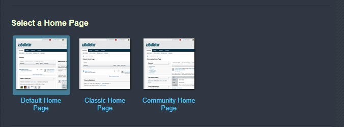
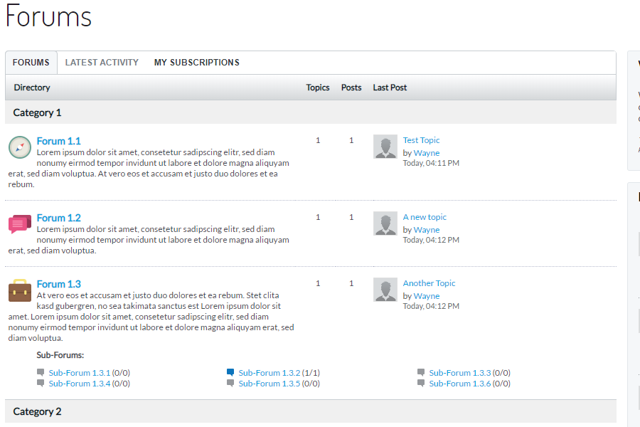

# vBulletin 5.5.5 Changes and Updates

> A preview release of vBulletin 5.5.5 is now available for download. This version should be used for internal testing. We do not recommend using preview releases on a live site.

## Front End Changes

### New Landing Pages

We have added two new page layouts that users can select from when using Site Builder's Quick Setup. These new Home Pages allow you to change the focus of your site with a few clicks. They include:

1. **Standard**: This is the default home page and the same as the one used in previous vBulletin 5.X versions. This is a 70/30 layout with the Activity Stream, Statistics, and What's Going On located in the left column and various search modules in the Right Column. The activity stream defaults to the Forums tab.
2. **Classic**: Provides a home page similar to older versions of vBulletin. This layout only contains the Activity Stream, Statistics, and What's Going On module in a single full width column. The Activity Stream defaults to the Forums tab.
3. **Community**: An end user oriented Home Page. This includes a 30/70 layout. The left column includes the Channel Navigation Module, Friend's Activity, and Birthdays at 30% width. The Right column includes the Activity Stream, Statistics, and What's Going On module. The Activity Stream defaults to the Latest Activity tab in this view.

You can try these new pages out on your site by clicking on Quick Setup from the Site Builder menu and choosing the page you would like to be your site's home page. Your selection will take effect immediately.

### Forum Status Icons

Forum Status icons are now larger and display at 32 X 32 pixels by default. This size can be reverted with a style variable.

Administrators can apply custom icons to individual forum channels. These will have their opacity reduced via CSS if a forum has been read. In addition to this, we have added "OnHover" events that will tell the user if the channel has been read or not.

Custom icons will have their background filled in with a prominent color similar to Group Icons. For information on configuring custom icons, see [Custom Status Icons](#custom-status-icons) below.

### Tagging

We have added an interface to allow users with permission of "Can Tag Other's Topics" to add tags. Users with this permission will be able to select "Tags" in the Topic Starter to add new tags. If the user owns the Topic and has permission to modify Tags, they can delete tags added by others.

### Inline Moderation

We have resolved a number of issues with Inline Moderation functionality. These updates will allow the following functions to behave as expected:

- Moving multiple nodes now allows for redirects to be created.
- Posts with Attachments can now be properly selected from the Inline Moderation menu.
- Thread Redirects can now have their titles changed by double-clicking in the title area.
- When selecting "View Topics" or "View Posts" when nothing is selected, an inline message is shown instead of redirecting to the search results page.
- An updated message is displayed if you attempt to move a topic into a Category that doesn't accept posts.
- Redirects are now deleted when the original node is deleted.
- Blog Entries can now be selected for inline moderation if only Sticky Topics are displayed.
- Channel Pagination should be calculated properly if you move nodes with redirects.

---

## Back End / AdminCP Changes

### Custom Status Icons

Administrators can now upload custom icons for individual forum channels. Icon upload is available within the AdminCP under Channel Management -> Channel Manager. Custom channel icons will be displayed at 50% opacity via CSS if the channel has been read by that user.

The display size of your channel icons is controlled by the value specified in the `icon_size_forum_icon` style variable. The default value is 32 X 32 pixels. A style variable was chosen so administrators can vary the value per style if necessary.

### Date Range for Notices

The display date for Notices has been expanded to enable a range of dates to display them. Using the date range, the notice will automatically turn off at the end of the range.

### File Scanning API

We have added new API routines to scan files when they are uploaded. The most common use of file scanning would be to check attachments for malware before saving them to disk. In order to demonstrate this functionality, we have provided a package that would enable scanning files via ClamAV. ClamAV is a popular command line tool used for malware detection. You can find information on installing ClamAV on their [website](https://www.clamav.net/documents/installing-clamav).

If you wish to build your own file scanner, there is a sample package in the `do_not_upload\development` directory of your download package. The API is available in the vB_Utility_Filescanner class. The file for which is located at `core\vb\utility\filescanner.php`.

### Image EXIF Information

We have added a configuration option to preserve image EXIF information on uploads. EXIF information contains data on color profiles, cameras, location, and more. Sometimes, EXIF information can be used to exploit either users or systems. Due to this we have previously stripped this information.

This functionality requires the use of the imagick or imagemagick image processing libraries. It will not work with the GD library. We **strongly recommend** that you install and configure ClamAV as well.

To enable this feature you must add a line to your config.php:

`$config['Misc']['preserve_exif'] = true;`

> Note: This feature is not currently available for vBulletin Cloud customers at this time.

### User Management

We have added a function to strip all tag associations created by a user. To accomplish this, edit the user within the AdminCP and select "Strip Tags" from the Quick User Tools drop down.

### XML Sitemap Handling

You can now exclude Pages from being included in the XML Sitemap that is generated for search engine indexing. This is accomplished in the AdminCP under `XML Sitemap -> Manage Content Priority`. Set the priority for Pages to "Exclude" in order to prevent them from being listing in the generated XML Sitemap.

The Registration page has been removed from the XML Sitemap.

### Refactored URL Class Handling

Handling and retrieving external URLs has been refactored in order to make the system more reliable and secure. Examples of where this is used include ReCaptcha, Facebook, and attachment uploads. Where necessary, we have merged the vB_Url class with the vB_Utility_Url class. After this, vB_Url has been removed from the system. This change will simplify code maintenance and improve security over time.

If you have third-party packages that rely on vB_Url, they will need to be updated to use the vB_Utility_Url class. Code for this class is located in `\core\vb\utility\url.php`.

For security purposes make sure the `/core/vb/vurl.php` file and `/core/vb/vurl` directories are deleted from your server. See [File Cleanup](#file-cleanup) below.

### Security Patch

The code from the security patch has been applied to vBulletin 5.5.5.

## Deprecated

### Announcements

We are currently in the process of merging Announcement and Notice functionality. After this is completed in an upcoming version, we will remove Announcements from the system. Merging these similar features will simplify code maintenance and allow us to provide more features to the Notice system over time.

### ImageMagick

Calling the ImageMagick executable directly has been deprecated in favor of using the imagick PECL library. We will remove direct support for ImageMagick in a future release. The imagick library functionality was added in vBulletin 5.5.4. We suggest updating your PHP installation to support imagick. You can find instructions on doing this in the [PHP Documentation](https://www.php.net/manual/en/imagick.installation.php).

### Internet Explorer Code

Internet Explorer 11 is currently supported but should be considered deprecated. Previous versions of Internet Explorer are not supported. We have removed some code specific to Internet Explorer from the system. This code had been added to support older versions of Internet Explorer. After upgrading, please make sure to follow the steps for [File Cleanup](https://www.vbulletin.com/forum/node/4391346). For more information on supported browsers please see the vBulletin [System Requirements](https://forum.vbulletin.com/node/4387853).

Users that access your site with IE should be encouraged to upgrade to the beta version of [Microsoft's Edge Browser](https://www.microsoftedgeinsider.com/en-us/) based on Chromium. This new browser is available for Windows 7, 8, 8.1, 10 and MacOS.

---

## Additional Information

### Install / Upgrade

Please see the forum topics below for the latest information on installing or upgrading vBulletin 5 communities.

- [Installation Instructions](https://www.vbulletin.com/forum/node/4391348)
- [Upgrade Instructions](https://www.vbulletin.com/forum/node/4391346)

### File Cleanup

After upgrading your vBulletin system, you should delete any possible obsolete files. In order to cleanup obsolete PHP files in the /core/ directory, please run the Suspect File Diagnostic in the AdminCP under Maintenance -> Diagnostics. It will list the files that need to be deleted as "Not part of vBulletin." Delete these files from your server.

You can obtain more information on why this is needed and instructions on how to do complete a file cleanup in this [**topic**](https://www.vbulletin.com/forum/node/4391346) in the vBulletin 5 Installs & Upgrades forum.

### System Requirements

Minimum System Requirements

- PHP Version: 7.1.0
- MySQL Version: 5.6.10
- MariaDB Version: 10.0.0

Recommended System Requirements

- PHP Version: 7.3 or higher
- MySQL Version: 8.0 or higher
- MariaDB Version: 10.3+

For more information see [vBulletin Connect System Requirements](https://www.vbulletin.com/forum/node/4391344).

#### PHP 7.1 End of Life

PHP 7.1.X will reach end of life on December 1st, 2019. It is recommended to upgrade to a minimum version of PHP 7.2 before this happens. In early 2020, we will increase the minimum required version of PHP to 7.2.0.

### Current Version Support Schedule

- Active Version - 5.5.5
- Security Patch - 5.5.4
- Security Patch - 5.5.3
- No Patch Release - 5.5.2 or earlier.

### Discussion

If you have any questions about these changes you may discuss them here: [node]4423284[/node]

If you find an issue with the software or wish to place a feature request please visit our [tracker](https://tracker.vbulletin.com).

In order to receive support for your vBulletin Product please visit our [community forums](https://www.vbulletin.com/forum/).
