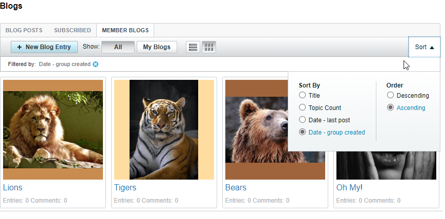
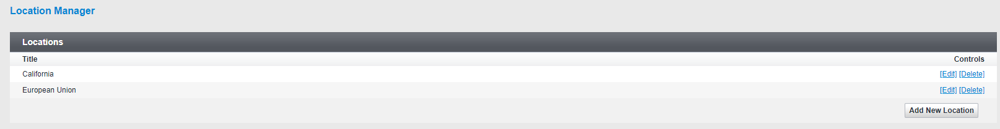
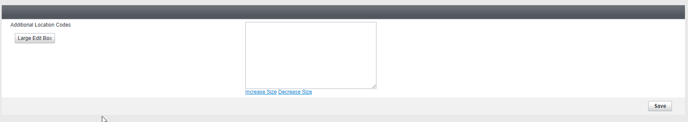

# vBulletin 5.6.1 Changes and Updates

vBulletin Connect 5.6.1 is now available for download.

## Front End Changes

### Blogs

The grid view has been added to the Blog Listing. This works similarly to the grid view on Groups. In addition to this, sorting functionality has been added to the Blog Listing.

### User Referrals

A user referral system has been added to vBulletin Connect. Through this system, users will be able to retrieve a custom URL that they can provide to their friends and family to register on your site. By default, they can retrieve this link on their User Profile page. When used, the referral link will create a cookie. On registration, they will give a referral credit to the person that referred them. Within the AdminCP, you'll be able to view who referred others on a new Referrals page (Admin CP -> Users -> Referrals).

Administrators have a couple of controls to manage this. First is a setting that allows you to specify how long a referral link is valid. The default is 30 days. You can change this in the AdminCP under Settings -> Options -> User Registration Options. Additionally, each Usergroup has a "Can Refer Users" permission. If this permission is set to No, users will not be able to generate a referral link.

If you would like to provide additional links for generating the referrals, you can do so on any standard HTML link by adding the js-refer-user CSS class to the link. For example: `<a href="#" class="js-refer-user">Referal Link</a>`

### Notifications

The display of notices in the page header has been improved. The Notifications link is now a drop-down menu that lists the number of each type of notification. This list will also include Reported/Flagged and Unapproved posts for moderation purposes. When the user also has vBulletin Messenger active, this list will update automatically between page loads.

### JavaScript Updates

Several JavaScript files have been extensively refactored in order to provide updated and more concise code. During the refactor, deprecated code may have been removed. If you experience issues after installing this version, you should refresh the browser cache to make sure that all files are updated properly. If the issues persist, please let us know by filing a [bug report](https://tracker.vbulletin.com/vbulletin5).

### Additional Resolved Issues

- Pagination for Social Group member lists have been fixed.
- Users can now select multiple emoji in the editor without having to reopen the panel for each one.
- The online/offline status icon has returned to the post bit.
- Resolved an issue that could cause publish dates on edited articles to advance by one month.
- Resolved an issue that prevented the merging of Photo Gallery posts.
- Improved date handling for non-English languages.
- The system now shows a proper error page if the user doesn't have permission to download an attachment.
- Private and Invisible Channels will no longer be displayed in search results. Private channels are channels the user does not have permission to view. Invisible Channels are those with a display order of 0.
- An option was added to the search module in order to filter Unapproved Posts from the results.
- The layout of all Message Center pages has been updated so they work better in Responsive mode.
- Resolved an issue so vBulletin Cloud administrators should no longer receive "Invalid Node ID" when accessing the Page Manager within Site Builder.
- Improved caching of phrases within local storage.

---

## Back End / AdminCP Changes

### Privacy and Consent

The Privacy and Consent tools have been expanded to allow the Administrator to decide which countries and US states to accept consent from. To choose the regions that you want to accept privacy consent for visit Settings -> Locations. A new installation will have two locations defined: California and European Union.

Clicking on Add Location allows you to select from a list of countries and/or all 50 United States. In addition to the predefined regions, you can add your own custom regions on the locations screen. The values for custom regions would depend on the output from the GEOIP API being used.

Once you have selected your regions then set your Privacy Options as normal under Settings -> Options -> Privacy Options.

### Node Tools

Resolved various issues that would prevent Move/Prune Nodes from working properly.

### Language Locales

The French, German, and Spanish language packages will properly include the .utf8 suffix in the specified Locale. This will provide improved support for UTF-8 characters.

### Upgrades from Legacy Versions

Upgrade steps used when upgrading from older versions of vBulletin 3.X have been updated to resolve potential errors that are caused from supporting older versions of PHP.

Early vBulletin 5.X upgrade steps have been updated to improve importing content when IDs are not consecutive. In addition to this, the feedback on various upgrade steps in the early 5.X series has been updated to be more concise while still providing progress updates.

### Other Resolved Issues

- Resolved an issue where outgoing emails can have an incorrect language assigned.
- Resolved various issues to improve support for PHP 7.4.
- Obsolete Public Usergroup permissions have been removed.
- Resolved an issue that could result in premature cache deletion for search logs.

---

## Additional Information

### Install / Upgrade

- [Installation Instructions](https://www.vbulletin.com/forum/node/4391348)
- [Upgrade Instructions](https://www.vbulletin.com/forum/node/4391346)

### File Cleanup

After upgrading your vBulletin system, you should delete any possible obsolete files. You can obtain more information on why this is needed and instructions on how to do this in this [**topic**](https://www.vbulletin.com/forum/node/4391346) in the vBulletin 5 Installs & Upgrades forum.

### System Requirements

Minimum System Requirements

- PHP Version: 7.2.0
- MySQL Version: 5.6.10
- MariaDB Version: 10.1.0

Recommended System Requirements

- PHP Version: 7.3 or higher
- MySQL Version: 8.0 or higher
- MariaDB Version: 10.3+

For more information see [vBulletin Connect System Requirements](https://www.vbulletin.com/forum/node/4391344).

### Current Version Support Schedule

- Active Version - 5.6.0
- Security Patch - 5.5.6
- Security Patch - 5.5.5
- No Patch Release - 5.5.4 or earlier.

### Discussion

If you have any questions about these changes you may discuss them here: [node]4437864[/node]

If you find an issue with the software or wish to place a feature request please visit our [tracker](https://tracker.vbulletin.com).

In order to receive support for your vBulletin Product please visit our [community forums](https://www.vbulletin.com/forum/).
